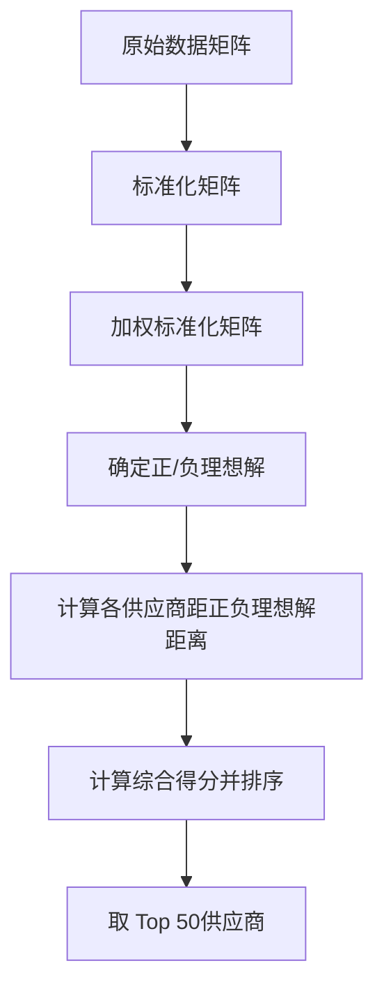

# 一、建立反映保障企业生产重要性的数学模型，确定50家最重要的供应商。

-------------------------------------------------------------

## 1.1 确定指标

### --- 稳定程度 ---

- **变异指数（CV）：供货商供货量的标准差与均值的比值**
 $$CV_i=\frac{\sigma _i}{\mu _i}\times 100\%$$
 如下，
 $\sigma_i$ 是第 $i$ 个供应商的标准差，$S_{i,t}$ 是第 $i$ 个供应商在第 $t$ 周的供货量，
 $T_{i}^{eff}$为第 $i$ 个供应商订货量>0的周次，$T_i$为订货量>0的周次数
 $$\sigma _i=\sqrt{\frac{\sum\limits_{t\in T_{i}^{eff}}{\left( S_{i,t}-\mu _i \right) ^2}}{T_i-1}}$$
 如下，
 $\mu_i$ 是第 $i$ 个供应商的有效供货量周均值
$$\mu _{i}=\frac{1}{T_i}\sum_{t\in T_{i}^{eff}}^{}{S_{i,t}}$$
 > ❗注意
 > 1. 仅统计订货量>0的周次，即企业有向该供货商订购货物的周次
 > 2. 订货量=0时不计入计算，即此时供货行为不反映供货商响应能力
 > 3. ==变异系数越小越稳定==
 
 - **订单满足波动率：反映供货商按订单要求供货的稳定程度**
$$OFV_i=\sqrt{\frac{1}{T_i}\sum_{t \in T_{i}^{eff}}{\left( \frac{S_{i,t}}{O_{i,t}}-\overline{OF}_i \right) ^2}}$$
其中，
$S_{i,t}$ 为第 $i$ 家供货商在第 $t$ 周的供货量，$O_{i,t}$ 为企业向第 $i$ 家供货商在第 $t$ 周的订货量。
如下，$\overline{OF}_i$ 为平均订单满足率：
$$\overline{OF}_i=\frac{1}{T_i}\sum_{t\in T_{i}^{eff}}^{}{\frac{S_{i,t}}{O_{i,t}}}$$
> ❗注意
> 1. 仅统计订货量>0的周次
> 2. 若订货量=0，供货量>0，记录为“超供事件”（可作为加分项）
> 3. ❗当 $O_{i,t}$ 过小时，$S_{i,t}/O_{i,t}$ 比值可能极大（如订货量1，供货量100），导致OFV失真。可以设定订货量下限（如 $O_{i,t}≥10$才纳入计算）。
> 4. ==OFV 越小越稳定==

### --- 可靠程度（供货可靠性）---

- **订单满足率（OFR）**
$$OFR_i=\frac{\sum\limits_{t\in T_{i}^{eff}}{\min \left( S_{i,t},O_{i,t} \right)}}{\sum\limits_{t\in T_{i}^{eff}}{O_{i,t}}}\times 100\%$$
其中，
$S_{i,t}$ 为第 $i$ 家供货商在第 $t$ 周的供货量，$O_{i,t}$ 为企业向第 $i$ 家供货商在第 $t$ 周的订货量
> ❗注意
> 1. 仅统计订货量>0的周次
> 2. ==OFR 越高越好==

- **缺货风险指数（SRI）**
$$SRI_i=\left( \frac{N_{i}^{short}}{T_i} \right) \times \left( \frac{\sum\limits_{t\in T_{i}^{eff}}{\left( O_{i,t}-S_{i,t} \right)}}{\sum\limits_{t\in T_{i}^{eff}}{O_{i,t}}} \right) \times 100$$
其中，
$N_i^{short}$ 为缺货周数（情况为$S_{i,t}<0.9 \times O_{i,t}$ 且 $O_{i,t}>0$）
$T_i$ 为订货量>0的周次数
> ❗注意
> 1. ==SRI 越低越好==

- **持续供货能力（CA）（衡量长期稳定供应原材料的能力）**
统计有效供货周次数（正常供货+主动供货+部分供货）和无效供货周次数（缺货+无交易）
计算持续供货能力：
$$CA_i=\frac{\text{有效供货周次数}}{\text{总周次数}}\times 100\%$$
>
||正常供货|主动供货|缺货|无交易|
|---|---|---|---|---|
|订货量|>0|=0|>0|=0|
|供货量|>0|>0|=0|=0|
> 1. 对于超供情况（主动供货），视为有效供货（体现了供应商主动性）
> 2. 对于部分供货情况（0<供货量<订货量），仍记为有效供货
> 3. ==持续供货能力越高越好==

### --- 平均供货能力指标 ---
- **有效供货量周均值**
$$\mu _{i}=\frac{1}{T_i}\sum_{t\in T_{i}^{eff}}^{}{S_{i,t}}$$

- **产能贡献指数（PCI）**
$$PCI_i=\mu _{i}\times \lambda _k\,\,\text{，} \text{其中}k\in \left\{ A,B,C \right\}$$
其中，
$\lambda_k$ 为 $k$ 类材料转换系数：每1立方米的 $k$ 材料能够生产多少产能，
通过材料转换系数$\lambda_k$ 统一量化三类原材料的产能价值
$$\lambda_A = \frac{1}{0.6} \approx 1.67, \lambda_B = \frac{1}{0.66} \approx 1.52, \lambda_C = \frac{1}{0.72} \approx 1.39$$
> 1. ==PCI 越高越好==

### --- 成本偏好指数 ---
成本越低，偏好越高：
$$p_k=\begin{cases}
	\cfrac{1}{1.2},k=A\\
	\cfrac{1}{1.1},k=B\\
	\cfrac{1}{1},k=C\\
\end{cases}$$

--------------------------------------------------------

## 1.2 量化分析
### --- 数据预处理 ---
- 清洗僵尸供应商（无效供应商）：剔除有效周数 $T_i<3$ 的供应商
- 处理异常值：供货量远超订货量的情况
> 比如 $S_{i,t} > 3 \times O_{i,t}$ 时，按 $3 \times O_{i,t}$ 截断

### --- 指标标准化与权重分配 ---
- 标准化方法
> 正向指标（OFR、CA、PCI）：$x' = \cfrac{x - \min}{\max - \min}$
> 负向指标（CV、OFV、SRI）：$x' = \cfrac{\max - x}{\max - \min}$
- 权重确定（参考）
>
|CV|OFV|OFR|SRI|CA|PCI|
|---|---|---|---|---|---|
|15%|15%|20%|20%|15%|15%|

### --- TOPSIS 模型求解 ---
- PCA 主成分分析，选取主成分作为评价指标
- 建立TOPSIS评价模型

### --- 敏感性分析 ---
- 蒙特卡洛模拟
> 在权重范围内随机扰动（±5%），统计 TOP 50 供应商的出现频率

---------------------------------------------------------

## 1.3 结果验证
### --- 分类筛选 ---
按材料分类（A/B/C），确保每类都有供应商入选

### --- 高覆盖 ---
入选供应商应覆盖
**高产能贡献**（PCI前20）、**高稳定性**（CV后20）、**高可靠性**（OFR前20）的多数供应商

------------------------------------------------------

## 1.4 代码以及图示
### --- 文件夹`code1_re` ---
1. 代码文件 `question1_re.py`
2. 原始数据集 `企业订货量.csv`和 `供货商供货量.csv`
3. 图片 `不同材料类型供应商综合得分分布.png`
4. 图片 `供应商评价指标间相关系数热力图.png`
5.  图片 `Top10供应商指标雷达图.png`
6.  图片 `供应商综合得分分布.png`
7.  图片 `CV_供应商变异系数.png`
8.  图片 `OFR_供应商订单满足率分布.png`
9.  图片 `Top50供应商各指标得分分布.png`
10. 图片 `Top50供应商材料分类占比.png`
11. 图片 `Top50供应商各指标得分密度分布.png`
12. top50结果集 `top_50_suppliers.csv`
13. 统计信息：
> 1. 供应商总数: 402
> 2. Top50得分范围: 0.6778 - 0.9529
> 3. 材料分类分布: A类 12家, B类 19家, C类 19家

### --- 文件夹`code1_monte` ---
1. 原始数据集： `企业订货量.csv`和 `供货商供货量.csv`
2. 代码文件： `monte.py`
3. top50结果集： `initial_top50_suppliers.csv`
4. 供应商在top50出现频率结果集：`supplier_frequency.csv`
5. 指标总结果集： `supplier_metrics.csv`
6. 排名稳定性： `supplier_stability.csv`
7. 图片 `出现频率分布.png`
> 图中红线代表50%出现频率的分界线
8. 图片 `初始频率VS出现频率.png`
9. 图片 `权重变化对Top50重叠率的影响.png`
10. 图片 `稳定供应商在不同权重下的排名.png`
11. 图片 `指标权重敏感性.png`
12. 图片 `Top50供应商出现频率.png`
> 图中红线代表90%出现概率的阈值线，可认为高度稳定的供应商
13. 图片 `Top50供应商排名稳定性.png`
14. 统计信息：
> 1. 平均Top50重叠率: 99.42%
> 2. 最稳定的10家供应商:
>
| |供应商ID  | 平均排名 | 排名变异系数 |
|---|---|---|---|
|0 | S229 |  1.0  |  0.0 |
|1 | S361 |  2.0  |   0.0|
|2 | S108 |  3.0  |   0.0|
|3 | S282 |  4.0  |   0.0|
|4 | S275 |  5.0  |   0.0|
|5 | S329 |  6.0  |   0.0|
|6 | S340 |  7.0  |   0.0|
|7 | S131 |  8.0  |   0.0|
|8 | S268 |  9.0  |   0.0|
|9 | S306 | 10.0  |   0.0|
>
> 3. 指标权重敏感性排序:
> 
||指标 |  敏感性|
|---|---|---|
|4 |  CA | 0.015556|
|1 | OFV | 0.011111|
|5 | PCI | 0.008889|
|2 | OFR | 0.008889|
|0 |  CV | 0.006667|
|3 | SRI | 0.004444|
> 4. 核心供应商（出现频率>90%）: 49家