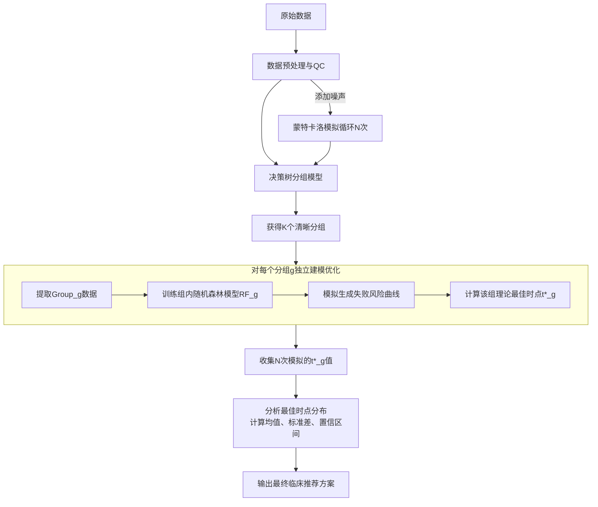

### 基于决策树与随机森林的NIPT最佳检测时点推荐模型

#### 一、核心目标与定义

**目标**：为不同特征的孕妇（主要依据BMI）推荐一个最佳的NIPT检测孕周 `t*`，以**最小化总体潜在风险** `C(t)`。

**总体潜在风险** `C(t)` 主要包含：
1.  **检测失败风险 (`R_failure`)**: Y染色体浓度 < 4% 的概率，导致需重复抽血。
2.  **结果误判风险 (`R_error`)**: 因胎儿DNA浓度不足或质量不佳导致的假阴性/假阳性风险。

**核心假设**：`R_error` 与 `R_failure` 高度相关，浓度不足是导致误判的主要因素之一。因此，**最小化 `R_failure` 即间接最小化了 `C(t)`**。我们将问题简化为：

**在保证检测成功率 `P(Conc ≥ 0.04) > 0.95` 的前提下，寻求最小的检测孕周 `t`**。

#### 二、数据预处理与特征工程

1.  **数据清洗与过滤**：
    *   处理缺失值，降噪（IQR去噪）
    *   **关键质量控制**：剔除 `GC含量` 不在 `[40%, 60%]` 范围内的样本，确保数据可靠性。
    *   **创建标签**：生成二进制变量 `达标否`，`1` (Conc ≥ 4%)，`0` (Conc < 4%)。

- `孕妇代码`：唯一标识每个孕妇（格式为A001，A002这种）
- `孕妇BMI`：BMI数值（同一孕妇不同时间的BMI可能不一样） 
- `检测孕周`：格式为13w+4或者14w这些，需要先进行数据转换 
- `Y染色体浓度`：用于确定达标时间。
- `GC含量`：要先确保GC含量在0.4~0.6之间，否则测序质量不高 
- `检测抽血次数`：孕妇的抽血次数，若出现某位孕妇有重复的次数（比如说同一个孕妇出现了两个4），代表着该次抽血检验了多次 
- **计算达标时间**：对于每个孕妇，按检测日期（检测日期格式为20230409这种）排序多次检测记录，首先要找到孕妇GC含量在0.4~0.6范围之内的数据行，如果有同一管血验了多次的情况，GC取平均值再判断，Y染色体浓度也取平均值。找到Y染色体浓度首次达到或超过0.04的检测孕周。如果某孕妇从未达标，排除该数据。

2.  **特征选择**：
    *   **分组特征 (用于决策树)**：`BMI`, `检测孕周`, `年龄`, `体重`, `身高`等（检测前可知）。
    *   **预测特征 (用于组内随机森林)**：`检测孕周`, `年龄`等（`BMI`不再需要，因其分组作用已完成）。

#### 三、第一阶段：基于决策树的风险分组

本阶段目标是利用决策树**生成具有不同风险特征（即不同浓度-孕周变化规律）的孕妇组别**。

1.  **模型建立**：
    *   **算法**: CART决策树。
    *   **特征 (X)**: `BMI`, `检测孕周`, `年龄`、`体重`。
    *   **目标 (y)**: `达标否`。
    *   **超参数调优**：通过交叉验证确定 `max_depth` (如3-4), `min_samples_split`, `min_samples_leaf` 等，以确保分组既有区分度又有足够统计效能。

2.  **分组规则提取**：
    *   训练后，决策树的每个**叶节点**即为一个最终分组。
    *   分组规则清晰明了，例如：
        *   **Group 1**: `BMI < 24.5`
        *   **Group 2**: `BMI >= 24.5 & 孕周 < 12.1`
        *   **Group 3**: `BMI >= 24.5 & 孕周 >= 12.1 & 年龄 < 38`
        *   **Group 4**: `BMI >= 24.5 & 孕周 >= 12.1 & 年龄 >= 38`

3.  **执行分组**：为数据集中每个样本赋予一个组标签 `Group_Label`。

#### 四、第二阶段：基于随机森林的组内风险预测与优化

本阶段目标是为**每个决策树分组**，建立一个精准模型，预测其失败风险随孕周的变化，并找到最佳时点 `t*`。

1.  **组内模型建立**：
    *   **对于每一个组 `g`**，提取其所有样本 `Data_g`。
    *   **算法**: 随机森林分类器 (RandomForestClassifier)。
    *   **特征 (X_g)**: `检测孕周`, `年龄`、`体重`、`身高`（**排除BMI**）。
    *   **目标 (y_g)**: `达标否`。
    *   **训练**: 在 `Data_g` 上训练随机森林模型 `RF_g`。

2.  **失败风险曲线生成**：
    *   创建模拟数据：固定组 `g` 的其他特征（取中位数），生成一系列孕周 `t_i` 
    *   使用 `RF_g` 预测每个 `t_i` 下的达标概率 `P_g(达标 | t_i)`。
    *   **失败风险**即为: `R_failure_g(t_i) = 1 - P_g(达标 | t_i)`。

3.  **寻找最佳时点 `t*_g`**：
    *   在失败风险曲线中，找到满足 `P_g(达标 | t_i) >= 0.95` 的**最小孕周 `t_i`**。
    *   **数学表达**:
        `t*_g = min{ t_i | P_g(达标 | t_i) >= 0.95 }`

#### 五、第三阶段：模型验证与误差分析（蒙特卡洛模拟）

评估模型推荐的最佳时点 `t*_g` 在存在检测误差时的**稳健性**。

1.  **引入误差**：假设关键特征（如`检测孕周`, `BMI`）存在测量误差，为其添加随机噪声 `ε ~ N(0, σ^2)`。
2.  **模拟循环**：重复以下过程 `N` (e.g., 1000) 次：
    *   为原始数据添加噪声，生成一份新数据集。
    *   执行 **第一阶段决策树分组**，为样本重新分配组标签。
    *   执行 **第二阶段组内预测**，为每个组重新计算最佳时点 `t*_g^{(k)}` (k为第k次循环)。
3.  **统计分析**：
    *   对于每个组 `g`，收集 `{t*_g^{(1)}, t*_g^{(2)}, ..., t*_g^{(1000)}}`。
    *   计算该组最佳时点的**分布**：均值 `μ_g`, 标准差 `σ_g`, 95%置信区间 `[L_g, U_g]`。
4.  **给出临床稳健建议**：
    *   如果 `σ_g` 很小（如<0.2周），则最终推荐 `μ_g`。
    *   如果 `σ_g` 较大，则选择**上置信区间 `U_g`** 作为推荐时点，以提供安全边际，确保在误差存在下仍有高成功率。

#### 六、最终交付成果

1.  **分组规则集**：以决策树形式或“if-else”规则列表呈现，清晰定义每个风险组。
2.  **最佳时点推荐表**：

    | 决策树分组 | 分组特征描述 | 理论最佳时点(周) | 稳健推荐时点(周) | 预期达标率 |
    | :--- | :--- | :--- | :--- | :--- |
    | Group 1 | BMI < 24.5 | 10.1 | 10.2 | 96.5% |
    | Group 2 | BMI≥24.5 & 孕周<12.1 | 11.8 | 12.0 | 95.8% |
    | Group 3 | BMI≥24.5 & 孕周≥12.1 & 年龄<38 | 13.2 | 13.5 | 95.3% |
    | Group 4 | BMI≥24.5 & 孕周≥12.1 & 年龄≥38 | 14.5 | 15.0 | 95.1% |

3.  **可视化**：
    *   决策树分裂图。
    *   每个分组的“失败风险 vs. 检测孕周”曲线图，标注 `t*_g` 和置信区间。

此方案严格使用了决策树和随机森林模型，通过两阶段建模和蒙特卡洛模拟，提供了一个**数据驱动、风险最优、且临床可解释**的个性化NIPT检测指南。