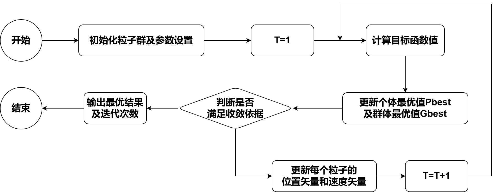
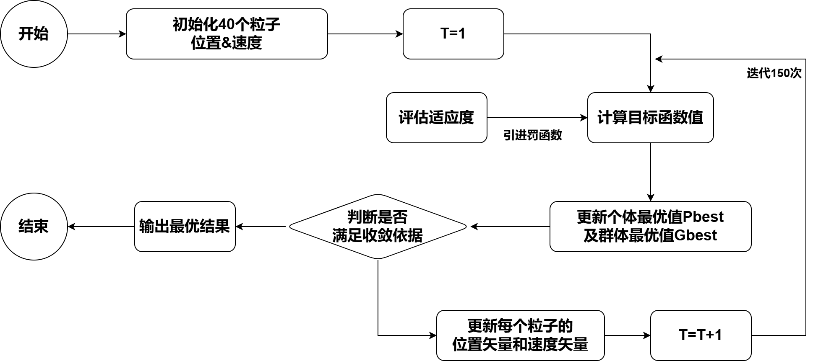

# 粒子群优化算法（PSO，Particle Swarm Optimization）

## 1. 通俗理解
粒子群算法的基本思想是通过群体中个体之间的协作和信息共享来寻找最优解。

#### 简单例子：
一群鸟在寻找食物，在这个区域中只有一只虫子，所有的鸟都不知道食物在哪。
但是它们知道自己的当前位置距离食物有多远，同时它们知道离食物最近的鸟的位置。
同时各只鸟在位置不停变化时候离食物的距离也不断变化，所以每个鸟一定有过离食物最近的位置。

#### 所以：
粒子群算法就是把鸟看成一个个粒子，并且他们拥有位置和速度这两个属性，然后根据自身已经找到的离食物最近的解和参考整个共享于整个集群中找到的最近的解去改变自己的飞行方向，最后我们会发现，整个集群大致向同一个地方聚集。而这个地方是离食物最近的区域，条件好的话就会找到食物。

--------------------------------------------

## 2. PSO
1. 在PSO中，每个优化问题的解都是搜索空间中的一个“粒子”。所有的粒子都有一个由被优化的函数决定的适应值(fitness value)，每个粒子还有一个速度决定他们的方向和距离。然后粒子们就追随当前的最优粒子在解空间中搜索。
2. 在每一次迭代中，粒子通过跟踪两个"极值"来更新自己。第一个就是粒子本身所找到的最优解，这个解叫做个体极值pBest。另一个极值是整个种群目前找到的最优解，这个极值是全局极值gBest。另外也可以不用整个种群而只是用其中一部分作为粒子的邻居，那么在所有邻居中的极值就是局部极值。

### 2.1 速度和位置
对于粒子 $i$，
其在N维空间的位置表示为矢量 $X_i=\left(x_1,x_2,\cdots,x_N\right)$
速度表示为矢量 $V_i=\left(v_1,v_2,\cdots,v_N\right)$
- 每个粒子都有一个由目标函数决定的适应值(fitness value)
- 粒子知道自己到目前为止发现的最好位置（$pbest$）和现在的位置$X_i$，看作粒子自己的经验
- 粒子知道到目前为止整个群体中所有粒子发现的最好位置（$gbest$），看作粒子同伴的经验

### 2.2 速度和位置的更新
#### PSO标准形式：（公式1和公式2）
$$v_i=v_i+c_1\times rand\left( 0,1 \right) \times \left( pbest_i-x_i \right) +c_2\times rand\left( 0,1 \right) \times \left( gbest_i-x_i \right) \tag{1}$$
$$x_i=x_i+v_i \tag{2}$$
其中，
$i=1,2,\cdots,N$，$N$为粒子总数
$v_i$：粒子速度
$rand\left( 0,1 \right)$：介于（0,1）之间的随机数
$x_i$：粒子的当前位置
$c_1$，$c_2$：自身学习因子和社会学习因子，通常都为2

对于公式1：
| 项         | 公式       | 含义       |
| ---------- | ---------------------------- | -------------------- |
| 记忆项     | $v_i$      | 表示上次速度大小和方向的影响     |
| 自身认知项 | $c_1\times rand\left( 0,1 \right) \times \left( pbest_i-x_i \right)$ | 是从当前点指向粒子自身最好点的一个矢量，表示粒子的动作来源于自己经验的部分 |
| 群体认知项 | $c_2\times rand\left( 0,1 \right) \times \left( gbest_i-x_i \right)$ | 是一个从当前点指向种群最好点的矢量，反映了粒子间的协同合作和知识共享       |

#### 标准PSO算法：（公式2和公式3）
$$v_i=\omega \times v_i+c_1\times rand\left( 0,1 \right) \times \left( pbest_i-x_i \right) +c_2\times rand\left( 0,1 \right) \times \left( gbest_i-x_i \right) \tag{3}$$
$\omega$：惯性因子，正值（>0）。值大，全局寻优能力强，局部寻优能力弱；反之亦然
我们使用当前采用较多的线性递减权值策略来计算动态$\omega$：
$$\omega ^{\left( t \right)}=\frac{\left( \omega _{ini}-\omega _{end} \right) \left( G_k-g \right)}{G_k+w_{end}}$$
其中，
$G_k$：最大迭代次数
$\omega_{ini}$：初始惯性权值，典型为0.9
$\omega_{end}$：迭代至最大进化代数时的惯性权值，典型为0.4

-------------------------------------------------------

## 3. 标准PSO算法流程
1. 初始化一群微粒(群体规模为$N$)，包括随机位置和速度
2. 评价每个微粒的适应度
3. 对每个微粒，将其适应值与其经过的最好位置$pbest$作比较，如果较好，则将其作为当前的最好位置$pbest$
4. 对每个微粒，将其适应值与其经过的最好位置$gbest$作比较，如果较好，则将其作为当前的最好位置$gbest$
5. 根据公式(2)、(3)调整微粒速度和位置
6. 未达到结束条件则转第2步
> 迭代终止条件一般选为最大迭代次数$G_k$或(和)微粒群迄今为止搜索到的最优位置满足预定最小适应阈值

------------------------------------------------------

## 4. 具体例子（2025华数杯C题Q2）
### 1. 粒子位置
每个粒子的位置表示5个LED通道的驱动权重组合，即$\left( \alpha _{blue},\alpha _{green},\alpha _{red},\alpha _{ww},\alpha _{cw} \right)$
这5个参数非负、总和为1且可归一化
最终合成的总光谱需要先将权重归一化，将归一化后的5个权重进行加权求和
$$SPD_{total}=\alpha _{blue}\cdot SPD_{blue}+\alpha _{green}\cdot SPD_{green}+\alpha _{red}\cdot SPD_{red}+\alpha _{ww}\cdot SPD_{ww}+\alpha _{cw}\cdot SPD_{cw}$$
这样对于380nm到780nm每1nm波长都有加权后的一个值，再代到CCT等五个指标去解和约束

### 2. 适应度函数（目标函数设计）
为了更好的提高粒子们的质量，在这里使用罚函数法，对不符合约束条件的粒子进行惩罚，确保粒子向满足约束的区域搜索

-- 场景1 日间照明模式 --
核心目标：最大化Rf
适应度函数：$fitness=-R_f+\text{惩罚项}$，最大化问题转为最小化问题
-- 场景2 夜间助眠模式 --
核心目标：最小化mel-DER
适应度函数：$fitness=\text{mel-DER}+\text{惩罚项}$,最小化目标值

> [!tip]
> 这里设置惩罚项为常数1000，使得违反约束的粒子适应度显著提高，从而被粒子群抛弃
> 具体约束条件查看原题

### 3. 粒子群参数设置
- **粒子数量**：40 个（平衡搜索多样性与计算效率）
- **最大迭代次数**：150 次（保证搜索充分性）
- **惯性权重$\omega$**：线性递减策略（从 0.9→0.4），初期增强全局搜索能力，后期增强局部收敛能力
- **学习因子**：$c_1=2.5$，$c_2=2.0$（认知项比社会项权重高一点，增强学习能力）
- **速度范围**：初始化速度为$\left[-0.1, 0.1\right]$（避免粒子过度跳跃，保证搜索稳定性）

### 4. 粒子更新规则

-- 速度更新 --
每个粒子的速度由三部分组成：  
$$v_{i}^{\left( t+1 \right)}=\omega \cdot v_{i}^{\left( t \right)}+c_1\cdot r_1\cdot \left( pbest_i-x_{i}^{\left( t \right)} \right) +c_2\cdot r_2\cdot \left( gbest-x_{i}^{\left( t \right)} \right) $$

- $\omega \cdot v_{i}^{\left( t \right)}$：惯性项，保留粒子当前运动趋势
- $c_1\cdot r_1\cdot \left( pbest_i-x_{i}^{\left( t \right)} \right)$：认知项，粒子向自身历史最优位置移动
- $c_2\cdot r_2\cdot \left( gbest-x_{i}^{\left( t \right)} \right)$：社会项，粒子向全局最优位置移动
- $r_1,r_2\in \left( 0,1 \right)$：随机因子，增加搜索随机性

-- 位置更新 --

粒子位置沿速度方向移动：  
$$x_{i}^{\left( t+1 \right)}=x_{i}^{\left( t \right)}+v_{i}^{\left( t+1 \right)}$$
位置更新后需确保权重非负，避免零权重导致光谱消失

### 5. 迭代优化流程

1. **初始化**：随机生成 40 个粒子的初始位置（权重）和速度
2. **评估适应度**：对每个粒子，根据权重合成光谱，计算`CCT、Rf、Rg、mel-DER`等参数，结合约束计算带惩罚的适应度
3. **更新最优**：
    - 个体最优（`pbest`）：若当前粒子适应度优于自身历史最优，则更新`pbest`
    - 全局最优（`gbest`）：若当前粒子适应度优于群体历史最优，则更新`gbest`
4. **更新速度与位置**：按上述公式更新所有粒子的速度和位置
5. **终止条件**：达到最大迭代次数（150 次）后，输出`gbest`对应的权重及参数

