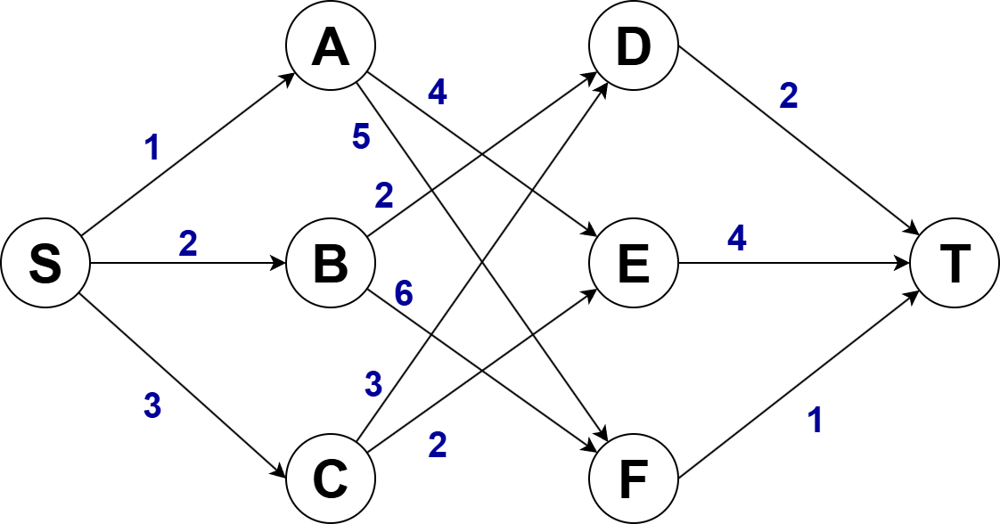

# 贪心算法

## 1. 核心思想
在每一步都采取当前状态下最优的选择，而不考虑未来可能产生的影响。虽然贪心算法不能保证总是得到最优解，但是在很多情况下，它都可以获得很好的结果。

-----------------

## 2. 理解
看一个例子：

假设我们有一个可以容纳100kg物品的背包，可以装各种物品。
我们有以下5种豆子，每种豆子的总量和总价值都各不相同。
为了让背包中所装物品的总价值最大，
我们如何选择在背包中装哪些豆子？每种豆子又该装多少呢？

| 物品 | 总量（kg） | 总价值（元） |
| ---- | ---------- | ------------ |
| 黄豆 | 100        | 100          |
| 绿豆 | 30         | 90           |
| 红豆 | 60         | 120          |
| 黑豆 | 20         | 80           |
| 巴豆 | 50         | 75           |

我们只需要算一算每个物品的单价，按照单价由高到低依次来选择就好了
单价由高到低：黑豆>绿豆>红豆>巴豆>黄豆
所以我们可以往背包里装20kg黑豆、30kg绿豆和50kg红豆

这样的思路，本质上就是借用了贪心算法

-----------------

## 3. 贪心算法解题步骤

### 3.1 贪心算法的问题类型
针对一组数据，我们定义了限制值和期望值，希望从中挑出几个数据，在满足限制值的情况下，期望值最大。

刚才的例子中，限制值就是重量不能超过100kg，期望值就是物品的总价值。这组数据就是5种豆子。我们从中选出一部分，满足重量不超过100kg，并且总价值最大。
（听着很像约束条件和目标函数）

### 3.2 尝试该问题能不能用贪心算法解决
每次选择当前情况下，在对限制值同等贡献量的情况下，对期望值贡献最大的数据

刚才的例子中，我们每次都是从剩下的豆子中选择单价最高的，也就是重量相同的情况下，对价值贡献最大的豆子

------------------------

## 4. 贪心算法缺陷
实际上，贪心算法并不总能给出最优解

举一个例子，在一个有权图里，我们从顶点S开始，找一条到顶点T的最短路径。贪心算法的解决思路是：每次都选择一条跟当前顶点相连的权最小的边，直到找到顶点T。
按照这种思路，贪心算法求出的最短路径是S -> A -> E -> T
但这并不是最短路径，最短路径是 S -> B -> D -> T

贪心算法不工作的主要原因是，**前面的选择，会影响后面的选择**。
如果我们第一步从顶点S走到顶点A，那接下来面对的顶点和边，跟第一步从顶点S走到顶点B，是完全不同的。所以，即便我们第一步选择最优的走法（边最短），但有可能因为这一步选择，导致后面每一步的选择都很糟糕，最终也就无缘全局最优解了。

---------------------------

## 5. 更多案例
感觉贪心算法要和最小生成树之类的模型结合起来才有用处，单独使用的场景并不多，我们用更多的案例来讲解。

### 5.1 分糖果
我们有$m$个糖果和$n$个孩子，我们现在要把糖果分给这些孩子吃。
但是糖果少，孩子多（$m<n$），所以糖果只能分配给一部分孩子。

每个糖果的大小不等，这$m$个糖果的大小分别是$s_1,s_2,s_3,\cdots,s_m$。
每个孩子对糖果大小的需求也是不一样的，只有糖果的大小大于等于孩子的对糖果大小的需求的时候，孩子才得到满足。假设这n个孩子对糖果大小的需求分别是$g_1,g_2,g_3,\cdots,g_n$。

**问题：如何分配糖果，能尽可能满足最多数量的孩子？**

可以把这个问题抽象成，从$n$个孩子中，抽取一部分孩子分配糖果，让满足的孩子的个数（期望值）是最大的。这个问题的限制值就是糖果个数$m$。

我们来看看如何用贪心算法来解决：
对于一个孩子来说，如果小的糖果可以满足，我们就没必要用更大的糖果，这样更大的就可以留给其他对糖果大小需求更大的孩子。
另一方面，对糖果大小需求小的孩子更容易被满足。
所以，我们可以从需求小的孩子开始分配糖果。
因为满足一个需求大的孩子跟满足一个需求小的孩子，对我们期望值的贡献是一样的。

我们每次从剩下的孩子中，找出对糖果大小需求最小的，然后发给他剩下的糖果中能满足他的最小的糖果，这样得到的分配方案，也就是满足的孩子个数最多的方案。

### 5.2 钱币找零
假设我们有1元、2元、5元、10元、20元、50元、100元这些面额的纸币，它们的张数分别是$c_1$、$c_2$、$c_5$、$c_10$、$c_20$、$c_50$、$c100$。

**问题：我们现在要用这些钱来支付$K$元，最少要用多少张纸币？**

在生活中，我们肯定是先用面值最大的来支付，如果不够，就继续用更小一点面值的，以此类推，最后剩下的用1元来补齐。

在贡献相同期望值（纸币数目）的情况下，我们希望多贡献点金额，这样就可以让纸币数更少，这就是一种贪心算法的解决思路。

### 5.3 区间覆盖
假设我们有$n$个区间，区间的起始端点和结束端点分别是
$$\left[ L_1,R_1 \right] ,\left[ L_2,R_2 \right] ,\cdots, \left[ L_n,R_n \right] $$
问题：
从这$n$个区间中选出一部分区间，这部分区间满足两两不相交（端点相交的情况不算相交），最多能选出多少个区间？

我们假设这$n$个区间中最左端点是 $L_{\min}$，最右端点是 $R_{\max}$。
这个问题就相当于，我们选择几个不相交的区间，从左到右将 $\left[L_{\min},R_{\max}\right]$ 覆盖上。
我们按照起始端点从小到大的顺序对这n个区间排序。

每次选择的时候，左端点跟前面的已经覆盖的区间不重合的，右端点又尽量小的。
这样可以让剩下的未覆盖区间尽可能的大，就可以放置更多的区间。
这实际上就是一种贪心的选择方法。

这个问题变形就可以变成任务调度问题，教师排课问题