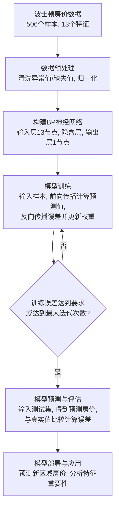

BP神经网络（Back Propagation Neural Network）
# 1. 说人话
我是一位老师，要教一个刚入学的小学生**（神经网络）** 如何辨别一个动物是猫还是狗

## 1.1 初次判断（前向传播）
- 我给学生看一张图片，上面有耳朵、尾巴、体型等特征**（输入数据）**
- 学生的大脑**（神经网络）** 里有一套他自己瞎猜的 **评分标准（初始权重和偏置）**。比如，他觉得有大耳朵的就是猫，有长尾巴的就是狗
- 学生根据这套瞎猜的标准，看了一下图片，得出结论：这是狗**（预测输出）**

## 1.2 发现错误（计算误差）
- 我告诉学生，这是一只猫**（真实值）**
- 学生发现自己错了，会计算自己的答案和正确答案之间的差距**（计算损失函数）**

## 1.3 反思与改正（反向传播）
- 学生开始反思自己为什么错了，学生原来觉得”长尾巴“这个特征很重要，给了它很高的分数**（权重）** ，但是这个判断不太对，会更加关注其他特征
- 于是，学生开始**反向**调整自己的那套标准**（更新权重和偏置）** ：降低”尾巴长度“这个特征的权重，提高”脸型圆润程度“和”是否喵喵叫“的权重

## 1.4 不断练习（迭代训练）
- 我接着给学生看下一张图片**（下一个训练样本）**
- 学生用刚调整过的标准再去判断，这次可能对，也可能还是错
- 如果错了，学生继续重复第2步和第3步，继续调整”评分标准“
- 学生经过看我给的成千上万张图片**（大量数据训练）** 后，学生的评分标准被调整的越来越准，最终成为专家

## 1.5 总结
- **神经网络：** 学生的大脑
- **前向传播：** 学生用当前的知识判断
- **损失函数：** 判断输出结果和正确答案差了多少
- **反向传播：** 学生根据错误，反向追溯哪里的理解出了问题，进行修正
- **权重/偏置：** 学生大脑里的”评分标准“或”知识点的重要性“
- **训练：** 不断做题、改错、调整知识点的过程

------------------------------------------------------------

# 2. 数学概念
BP神经网络是一种**模仿人脑工作方式的计算模型**，它能通过学习数据中的规律，解决分类、预测等问题。它的名字“BP”来自“反向传播”（Back Propagation），也就是它通过**不断调整参数**来减少预测误差的机制。

BP神经网络由三层组成：

1. **输入层**：接收输入数据（比如图像、数字等）。
2. **隐藏层**：中间的处理层（可以有1层或多层），负责提取数据特征。
3. **输出层**：输出最终结果（比如分类标签、预测值等）。

每一层的神经元（节点）通过 **权重（Weight）** 和 **偏置（Bias）** 连接，权重决定了输入信号的重要性，偏置是调整神经元激活阈值的参数。

-----------------------------------------------------------

# 3. 具体例子

假设我们有一个简单的BP神经网络：
- 输入层有2个神经元（输入数据 $x_1$，$x_2$）
- 隐藏层有3个神经元
- 输出层有1个神经元

## 3.1 前向传播
计算神经网络”猜测值“的过程

### 步骤 1 ：计算隐藏层的输入
$$z_j=w_{1j}x_1+w_{2j}x_2+b_j,\text{其中}j=1,2,3$$
- $x_i$：输入的第 $i$ 个特征（比如尾巴长度、耳朵大小）
- $w_{ij}$：输入层第$i$个神经元到隐藏层第$j$个神经元的权重
- $b_j$：隐藏层第$j$个神经元的偏置（像一个门槛值，让模型更灵活）

### 步骤 2 ：通过激活函数得到隐藏层的输出
隐藏层的输出是输入 $z_j$​ 经过激活函数 $f$ 的结果：
$$a_j=f\left( z_j \right) $$
常见的激活函数是 **Sigmoid函数**：
$$f\left( z \right) =\frac{1}{1+e^{-z}}$$

> [!tip] 为什么需要激活函数
> 如果没有激活函数，神经网络只能处理线性问题，无法处理复杂的非线性问题。激活函数给神经网络引入了非线性的能力

### 步骤 3 ： 计算输出层的输入
$$s=v_1a_1+v_2a_2+v_3a_3+c$$
- $v_j$：隐藏层第$j$个神经元到输出层的权重
- $c$：输出层的偏置

### 步骤 4 ：通过激活函数得到输出层的输出
$$y=g\left( s \right) $$
如果任务是回归（预测连续值），$g\left( s \right)$可以是恒等函数（$g\left( s \right)=s$）
如果是分类任务，可以使用 **Softmax** 或 **Sigmoid** 函数

## 3.2 损失函数
计算预测值与真实值的差距，常用**均方误差（MSE）**
假设真实值是$t$，预测值是$y$
$$E=\frac{1}{2}\left( t-y \right) ^2$$
目标是通过调整权重和偏置，让$E$尽可能小

## 3.3 反向传播
这是根据误差**反向**调整权重和偏置的过程。这里会用到微积分中的**链式法则**，目的是计算误差对每个权重/偏置的**梯度**（也就是导数），告诉我们参数应该朝哪个方向调整，调整多少才能降低误差。

### 步骤 1 ：计算输出层的误差梯度
$$\delta ^{\left( out \right)}=\left( t-y \right) \cdot g'\left( s \right) $$
- $g'\left( s \right)$ 是输出层激活函数的导数

### 步骤 2：更新输出层的权重和偏置
$$v_{j}^{\left( new \right)}\gets v_{j}^{\left( old \right)}+\eta \cdot \delta ^{\left( out \right)}\cdot a_j$$
$$c^{\left( new \right)}\gets c^{\left( old \right)}+\eta \cdot \delta ^{\left( out \right)}$$
- $\eta$ 是学习率（学习步长，一般设为0.01~0.1），控制每次更新的步幅。如果太大，可能会错过最值点，甚至无法收敛；如果太小，更新速度会变慢，训练时间会很长

### 步骤 3：计算隐藏层的误差梯度
$$\delta _{j}^{\left( hidden \right)}=\delta ^{\left( out \right)}\cdot v_j\cdot f'\left( z_j \right) $$
- $f'\left( z_j \right)$ 是隐藏层激活函数的导数

### 步骤 4：更新隐藏层的权重和偏置
$$w_{ij}^{\left( new \right)}\gets w_{ij}^{\left( old \right)}+\eta \cdot \delta _{j}^{\left( hidden \right)}\cdot x_i$$
$$b_{j}^{\left( new \right)}\gets b_{j}^{\left( old \right)}+\eta \cdot \delta _{j}^{\left( hidden \right)}$$

## 3.4 重复迭代
这样子不断前向传播和反向传播，直到误差 $E$ 足够小（比如小于0.001）

-------------------------------------------------------------

# 4. 继续抽象

## 4.1 前向传播

这是计算神经网络“猜测值”的过程

#### 公式 1: 隐藏层的输入和输出
$$\text{隐藏层输入} : z_h = \sum_{i=1}^{n} (w_{ih} \cdot x_i) + b_h$$
$$\text{隐藏层输出} : a_h = f(z_h)$$

- $x_i$: 输入的第 $i$ 个特征
- $w_{ih}$: 连接输入层第 $i$ 个节点和隐藏层第 $h$ 个节点的**权重**（就是这个特征有多重要）
- $b_h$: 隐藏层第 h 个节点的**偏置**（像一个门槛值，让模型更灵活）
- $z_h$: 隐藏层第 h 个节点接收到的所有输入信号的加权和
- $f()$: **激活函数**
- $a_h$: 经过激活函数“加工”后的隐藏层输出

#### 公式 2: 输出层的输入和输出（同理）

$$\text{输出层输入} : z_o = \sum_{h=1}^{m} (w_{ho} \cdot a_h) + b_o$$
$$\text{输出层输出} : \hat{y} = f(z_o)$$

$\hat{y}$ 就是神经网络最终的**预测值**（比如学生判断是狗的概率）

## 4.2 损失函数

这是计算“猜得多错”的公式

#### 公式 3: 均方误差损失函数

$$E = \frac{1}{2} (\hat{y} - y)^2$$
- $\hat{y}$: 预测值（学生的答案）
- $y$: 真实值（老师的答案）
- $E$: 误差（Loss），我们训练的目标就是让这个 E 越小越好

## 4.3 反向传播⭐

这是根据误差**反向**调整权重 $w$ 和偏置 $b$ 的过程。这里会用到微积分中的**链式法则**，目的是计算误差对每个权重/偏置的**梯度**（也就是导数），告诉我们参数应该朝哪个方向调整，调整多少才能降低误差。

#### 公式 4: 输出层权重的梯度
$$\frac{\partial E}{\partial w_{ho}} = \frac{\partial E}{\partial \hat{y}} \cdot \frac{\partial \hat{y}}{\partial z_o} \cdot \frac{\partial z_o}{\partial w_{ho}} = (\hat{y} - y) \cdot f’(z_o) \cdot a_h$$
- $\frac{\partial E}{\partial w_{ho}}$ 这个梯度告诉我们，权重 $w_{ho}$的变化会如何影响最终误差 E。

#### 公式 5: 隐藏层权重的梯度（链式法则再传一步）

$$\frac{\partial E}{\partial w_{ih}} = \frac{\partial E}{\partial a_h} \cdot \frac{\partial a_h}{\partial z_h} \cdot \frac{\partial z_h}{\partial w_{ih}}$$

## 4.4 参数更新

我们知道了每个参数的梯度，现在就可以用最基础的**梯度下降法**来更新它们了。

#### 公式 6: 权重更新规则

$$w_{\text{new}} = w_{\text{old}} - \eta \cdot \frac{\partial E}{\partial w_{\text{old}}}$$
*   $\eta$ ：**学习率**。这是一个非常重要的超参数，它控制着每次更新的步幅。
    *   学习率太大：容易一步迈过头，错过最低点，甚至无法收敛。
    *   学习率太小：更新速度太慢，训练时间会非常长。
*   $\frac{\partial E}{\partial w}$ ：就是我们上面辛苦算出来的梯度。

偏置 \\(b\\) 的更新公式完全类似：
$$b_{\text{new}} = b_{\text{old}} - \eta \cdot \frac{\partial E}{\partial b_{\text{old}}}$$

------------------------------------------------------

# 5. 训练一个神经网络来模拟“与”运算

| 输入 x1 | 输入 x2 | 输出 y (真实值) |
| :-----: | :-----: | :-------------: |
|    0    |    0    |        0        |
|    0    |    1    |        0        |
|    1    |    0    |        0        |
|    1    |    1    |        1        |

我们的目标是，输入任意 $(x_1, x_2)$，网络能输出正确的 $y$

--

## 第一步：设计网络结构

#### 设计网络
为了简单，我们设计一个最小的网络：
- **输入层**：2个节点 $(x_1, x_2)$
- **隐藏层**：1个节点 (只有一个神经元！足够处理这个简单问题)
- **输出层**：1个节点 (ŷ，我们的预测值)
- **激活函数**：选择 **Sigmoid** 函数，因为它输出在0~1之间，适合本任务。
	- 它的导数有一个很好的特性：$f'(z) = f(z) \cdot (1 - f(z))$

#### 初始参数（随机初始化）
我们给所有的**权重 (w)** 和**偏置 (b)** 一个初始值。
假设我们初始化为：
- $w_1$ (连接 $x_1$ 到隐藏层节点)： 0.5
- $w_2$ (连接 $x_2$ 到隐藏层节点)： 0.5
- $b_h$ (隐藏层节点的偏置)： 0.5
- $w_3$ (连接隐藏层到输出层)： 0.5
- $b_o$ (输出层节点的偏置)： 0.5

**学习率 $(\eta)$**： 0.1 （我们自己设定的一个值）

--

## 第二步：进行一次完整的训练（以样本 (1, 1) -> 1 为例）

#### 1. 前向传播 (Forward Pass)

**输入**： $x_1 = 1, x_2 = 1$

**a) 计算隐藏层节点的输入和输出**：
$$z_h = (w_1 \cdot x_1) + (w_2 \cdot x_2) + b_h = (0.5 \cdot 1) + (0.5 \cdot 1) + 0.5 = 1.5$$
$$a_h = f(z_h) = \frac{1}{1 + e^{-1.5}} ≈ 0.8176$$

**b) 计算输出层节点的输入和输出（预测值 $\hat{y}$）**：
$$z_o = (w3 * a_h) + b_o = (0.5 * 0.8176) + 0.5 = 0.9088$$
$$\hat{y} = f(z_o) = \frac{1}{1 + e^{-0.9088}} ≈ 0.7127$$

**结果**：
网络输出 ŷ = 0.7127，但我们期望的输出是 y = 1。
错了！所以我们需要反向传播来调整参数。

#### 2. 反向传播 (Backward Pass) — 计算梯度

我们的目标是计算误差 $E$ 对每个参数 ($w_1, w_2, b_h, w_3, b_o$) 的偏导数（梯度）。

**定义损失函数（均方误差）**： 
$$E = \frac{1}{2}(\hat{y} - y)^2$$

**a) 计算输出层参数的梯度**：
$$\frac{\partial E}{\partial \hat{y}}=\hat{y}-y=0.7127-1=-0.2873$$
$$\frac{\partial \hat{y}}{\partial z_o}=f'\left( z_o \right) =\hat{y}\cdot \left( 1-\hat{y} \right) \approx 0.2848$$
$$\frac{\partial z_o}{\partial w_3}=a_h\approx 0.8176$$
$$\frac{\partial z_o}{\partial b_o}=1$$

现在，用**链式法则**求我们最关心的梯度：
$$\frac{\partial E}{\partial w_3}=\frac{\partial E}{\partial \hat{y}}\cdot \frac{\partial \hat{y}}{\partial z_o}\cdot \frac{\partial z_o}{\partial w_3}=\left( -0.2873 \right) \times 0.2048\times 0.8176=-0.0481$$
$$\frac{\partial E}{\partial b_o}=\frac{\partial E}{\partial \hat{y}}\cdot \frac{\partial \hat{y}}{\partial z_o}\cdot \frac{\partial z_o}{\partial b_o}=\left( -0.2873 \right) \times 0.2048\times 1=-0.0588$$

**b) 计算隐藏层参数的梯度**（链式法则再往前传一步）：
我们需要计算误差对 $w_1$, $w_2$, $b_h$ 的梯度。以 w1 为例：
$$\frac{\partial E}{\partial a_h}=\frac{\partial E}{\partial \hat{y}}\cdot \frac{\partial \hat{y}}{\partial z_o}\cdot \frac{\partial z_o}{\partial a_h}=\left( -0.2873 \right) \times 0.2048\times w_3=-0.0294$$
$$\frac{\partial a_h}{\partial z_h}=f'\left( z_h \right) =a_h\cdot \left( 1-a_h \right) \approx 0.149$$
$$\frac{\partial z_h}{\partial w_1}=x_1=1$$

再次使用链式法则：
$$\frac{\partial E}{\partial w_1}=\frac{\partial E}{\partial a_h}\cdot \frac{\partial a_h}{\partial z_h}\cdot \frac{\partial z_h}{\partial w_1}=\left( -0.0294 \right) \times 0.149\times 1=-0.00438$$
同理
$$\frac{\partial E}{\partial w_2}\approx -0.00438$$
$$\frac{\partial E}{\partial b_h}=\frac{\partial E}{\partial a_h}\cdot \frac{\partial a_h}{\partial z_h}\cdot \frac{\partial z_h}{\partial b_h}=\left( -0.00294 \right) \times 0.149\times 1=-0.00438$$

#### 3. 更新参数 (Gradient Descent)

使用梯度下降公式：`新参数 = 旧参数 - 学习率 × 对应梯度`

$$w_{3}^{\left( new \right)}=w_{3}^{\left( old \right)}-\eta \cdot \frac{\partial E}{\partial w_3}=0.5-0.1\times \left( -0.0481 \right) =0.50481$$
$$b_{o}^{\left( new \right)}=b_{o}^{\left( old \right)}-\eta \cdot \frac{\partial E}{\partial b_o}=0.5-0.1\times \left( -0.0588 \right) =0.50588$$
$$w_{1}^{\left( new \right)}=w_{1}^{\left( old \right)}-\eta \cdot \frac{\partial E}{\partial w_1}=0.5-0.1\times \left( -0.00438 \right) =0.500438$$
$$w_{2}^{\left( new \right)}=w_{2}^{\left( old \right)}-\eta \cdot \frac{\partial E}{\partial w_2}=0.5-0.1\times \left( -0.00438 \right) =0.500438$$
$$b_{h}^{\left( new \right)}=b_{h}^{\left( old \right)}-\eta \cdot \frac{\partial E}{\partial b_h}=0.5-0.1\times \left( -0.00438 \right) =0.500438$$

--

## 第三步：理解发生了什么

我们只用了一个样本$(1,1)$ 进行了一次训练（一次迭代）
- **训练前**：输入 $(1,1)$，输出 $\hat{y}=0.7127$，误差很大
- **训练后**：所有权重和偏置都**微微增大**了（因为梯度是负的，减去一个负数等于加正数）
- **这意味着什么？** 参数增大，会使下一次计算出的 $z_o$ 和 $z_h$ 更大。而 Sigmoid 函数输入越大，输出越接近1。所以下次再遇到 $(1,1)$，$\hat{y}$ 的输出会比这次的 0.7127 更接近 1（比如可能是 0.72）。**我们的预测进步了一点点！**

--

## 第四步：后续工作

1.  **继续训练**：拿下一个样本（比如 (0,0)）重复这个过程，用**更新后的参数**进行前向传播和反向传播。
2.  **遍历数据集**：把所有4个样本都训练一遍，称为一个 **Epoch**。
3.  **多次迭代**：通常需要成百上千个 Epoch，参数才会慢慢调整到最佳值。
4.  **最终效果**：经过充分训练后，当输入 $(1,1)$，$\hat{y}$ 会非常接近 1；输入 $(0,0)$，$\hat{y}$ 会非常接近 0。

--

## 总结

这个例子把BP神经网络“猜错-找错因-改正”的核心思想完全数字化了。
虽然一次更新的效果微乎其微，但成千上万次的微小调整，最终能让网络学会复杂的规律。
在实际应用中，这一切都由计算机高速完成，我们只需要定义好网络结构和数据即可。

--------------------------------------------------------

# 6. 房价预测

房价预测是BP神经网络一个非常经典且实用的应用场景。它恰好能发挥神经网络处理**多因素、非线性关系**的优势。这里的例子会进行一定简化，清晰理解整个过程和核心公式。

## 6.1 波士顿房价预测案例

许多经典的房价预测研究都使用过**波士顿房价数据集**（Boston Housing Dataset）。这个数据集包含了波士顿周边506个地区的房价中位数（单位：千美元）以及与之相关的13个特征。

这些特征包括：
*   **CRIM**：城镇人均犯罪率
*   **ZN**：住宅用地所占比例
*   **INDUS**：城镇中非商业用地所占比例
*   **CHAS**：查尔斯河虚拟变量（1表示靠近河流，0则相反）
*   **NOX**：一氧化氮浓度（环保指标）
*   **RM**：每栋住宅的平均房间数
*   **AGE**：1940年前建成的自主单位比例
*   **DIS**：距离5个波士顿就业中心的加权距离
*   **RAD**：距离高速公路的便利指数
*   **TAX**：每万美元的全额财产税
*   **PTRATIO**：城镇师生比例
*   **B**：城镇中黑人比例的相关计算值
*   **LSTAT**：房东属于低收入人群的比例

我们的目标是让神经网络学习这些特征与房价中位数（`MEDV`）之间的复杂关系。

下面是这个模型的简化工作流程。

--

## 6.2 核心数学公式

在这个例子中，核心的数学公式和我们之前讨论的BP神经网络基本原理是一致的，只是维度提高了。

1.  **前向传播 (Forward Propagation)**

    *   **输入层到隐藏层** (以第一个隐藏层神经元 $h_1$为例):
        $$z_{h1} = w_{1, h1} \cdot x_1 + w_{2, h1} \cdot x_2 + ... + w_{13, h1} \cdot x_{13} + b_{h1}$$
        $$a_{h1} = f(z_{h1})$$ ($f$ 通常是 ReLU 或 Sigmoid 函数)
        其中 $x_1$ 到 $x_{13}$ 是归一化后的13个特征值，$w_{1,h1}$ 是连接输入特征 $x_1$ 和隐藏层神经元 $h_1$ 的权重，$b_{h1}$ 是神经元 $h_1$ 的偏置。

    *   **隐藏层到输出层** (假设只有一个输出神经元 $\hat{y}$，即预测房价):
        $$z_o = w_{h1, o} \cdot a_{h1} + w_{h2, o} \cdot a_{h2} + ... + w_{hm, o} \cdot a_{hm} + b_o$$
        $$\hat{y} = f(z_o) \quad (对于回归问题，输出层有时使用线性激活函数，即 f(x)=x)$$

2.  **损失函数 (Loss Function) - 均方误差 (MSE)**
    这是衡量预测值 $\hat{y}^{(i)}$ 与真实房价 $y^{(i)}$ 差异的函数，对于所有 $m$ 个训练样本：
    $$E = \frac{1}{2m} \sum\limits_{i=1}^{m} (\hat{y}^{(i)} - y^{(i)})^2$$
    我们的目标就是通过调整所有参数（权重和偏置）来最小化这个损失函数 $E$。

3.  **反向传播 & 参数更新**
    通过计算损失函数对每个权重和偏置的**梯度**（偏导数），使用**梯度下降法**进行更新。公式和之前介绍的类似，只是需要计算偏导数的参数更多了。
    $$w_{new} = w_{old} - \eta \cdot \frac{\partial E}{\partial w_{old}}$$
    $$b_{new} = b_{old} - \eta \cdot \frac{\partial E}{\partial b_{old}}$$
    其中 $\eta$ 是学习率。

--

## 6.3 预测结果与分析

训练好的模型，在测试集上进行预测后，我们可以计算**均方根误差 (RMSE)** 或**平均绝对百分比误差 (MAPE)** 等指标来评估模型精度。

例如，RMSE 为 4.5（千美元）意味着预测价格与真实价格平均相差大约 4500 美元。

我们可以用一个表格来展示**部分测试样本的真实值与预测值**（仅为示例，数值虚构）：

| 样本编号 | 真实房价 (千美元) | 预测房价 (千美元) | 绝对误差 (千美元) |
| :--- | :--- | :--- | :--- |
| 1 | 24.5 | 25.1 | 0.6 |
| 2 | 31.2 | 29.8 | 1.4 |
| 3 | 18.9 | 20.3 | 1.4 |
| ... | ... | ... | ... |
| **平均** | **-** | **-** | **~4.5 (RMSE)** |

**模型的应用**：
*   **预测房价**：给定一个新的地区的13项特征，输入网络即可得到预测房价。
*   **特征重要性分析**：通过分析网络的连接权重或其他方法（如 permutation importance），可以定性地理解哪些特征对房价影响最大。例如，通常 `RM`（房间数）和 `LSTAT`（低收入人群比例）会是很强的预测因子。

--

## 6.4 局限性

BP神经网络在房价预测中也有其局限性，这也是为什么会有很多像**遗传算法（GA）优化BP神经网络**、**CS-AGA-BP** 或与 **ARIMA模型**、**马尔可夫链** 组合等改进方法的原因。

1.  **数据依赖性强**：模型的性能严重依赖于**数据质量和数量**。数据需要具有代表性，且需要进行充分的清洗和预处理（如处理异常值、缺失值）。
2.  **容易过拟合**：特别是当网络结构复杂而训练数据不足时，模型可能**过度记忆**训练数据的细节和噪声，导致在训练集上表现很好，但在未见过的测试集上表现很差。通常采用**Dropout、正则化**等技术来缓解。
3.  **局部极小值**：梯度下降法可能使网络收敛到**局部最优点**，而非全局最优点，从而影响预测精度。使用遗传算法等全局优化算法来初始化权重和阈值是一种有效的改进策略。
4.  **“黑箱”特性**：神经网络虽然预测精度可能很高，但其内部决策过程难以直观解释，不像线性回归那样能给出明确的系数来说明每个特征的具体影响。这对于需要洞见因果关系的分析来说是一个缺点。

-----------------------------------------------------

# 7. 优缺点

## 7.1 优点
- 强大的非线性拟合能力：能解决复杂的非线性问题
- 自适应学习能力：通过调整参数自动学习数据规律
- 泛化能力强：训练后能对新数据做出预测

## 7.2 缺点
- 收敛速度慢：可能需要迭代成千上万次
- 容易陷入局部最小值
- 参数的设置敏感：学习率、网络层数、神经元数量等参数需要经验调整